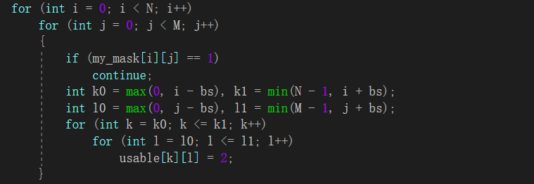

### Optimization for Texture Propagation

##### 1. Expended the Area to Fix

- Use a novel map to represent the expended area of the specific mask
- As for each edge point, the neighborhood of it should also be fixed

```

```

##### 2. Narrow the Area to Reference

- For each point, judge if it is the one with property texture
- In order to avoid the points near the structure line 