### Pre-process of the dataset

##### 1. Mix the Mask, Structure Line and Origin Image

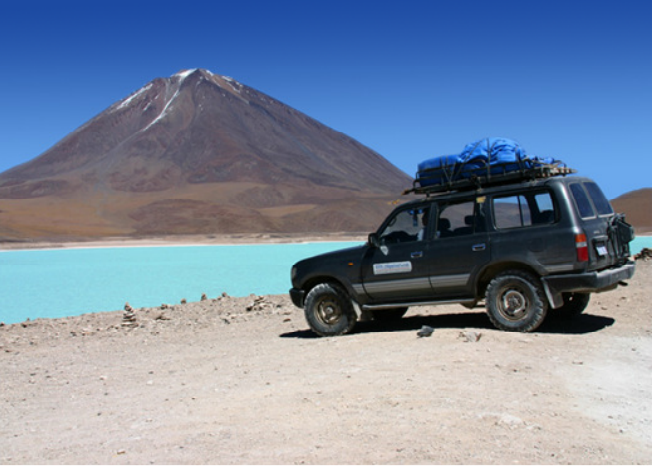

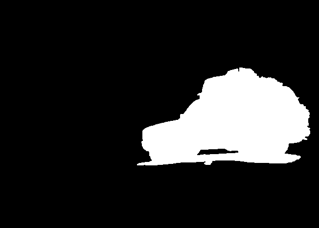

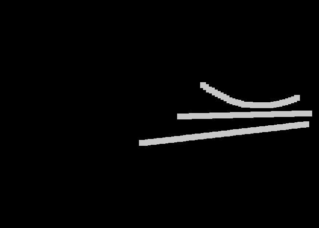

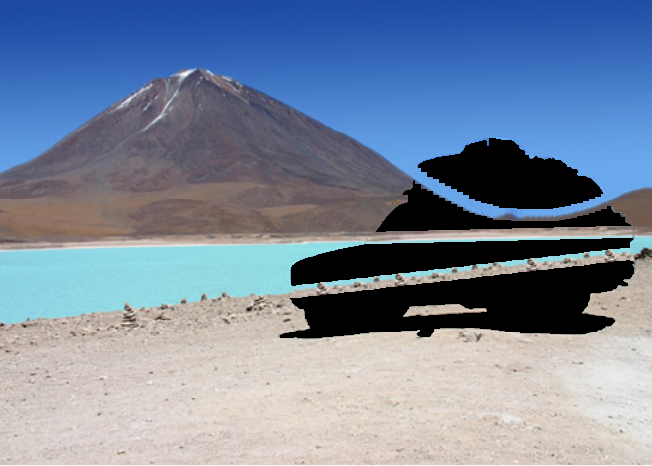

##### 2. Find the Adjacent Domain

- Traversing the image to generate a Map

  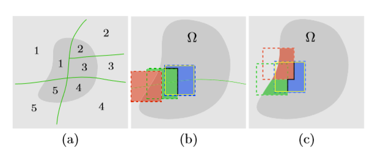

### Region-filling algorithm


##### 1. Find the edge points set

- Find the 8 points near one pixel in a square

- OR-Equal

  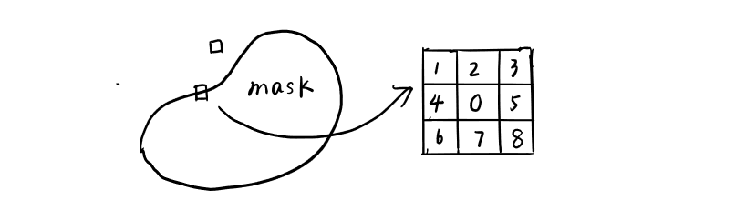

```c++
for(int i = 1; point i form [point1 ~ point8])
{
    is_mask |= (mask[point i] == 0);
}
Edge_map[p][q] = 1;
return Edge_map;
```


##### 2. Computing patch priority

- Filling order is crucial to non-parametric texture synthesis
- Best-first filling algorithm

这里要用2页PPT介绍（第一页介绍本文方法，第二页介绍后人方法，图片之后补充上去）

##### 2. Propagation texture information

- In specific area
- In neighborhood

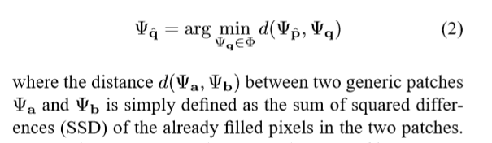

number of points: input_length/patch

for each point: patch

##### 3. Updating confidence value


*放视频！*

### Optimization for Texture Propagation

##### 1. Expended the Area to Fix

- Use a novel map to represent the expended area of the specific mask
- As for each edge point, the neighborhood of it should also be fixed

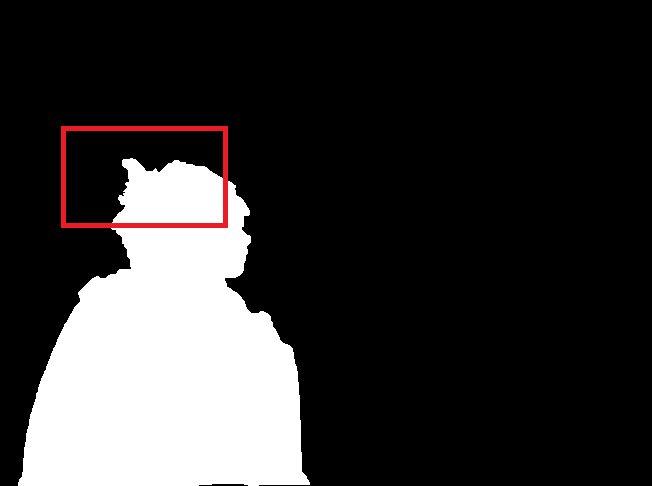

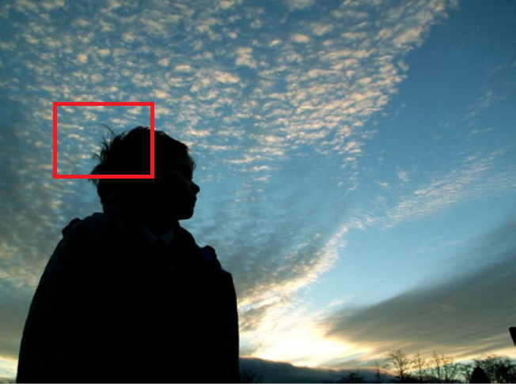

##### 2. Narrow the Area to Reference

- For each point, judge if it is the one with property texture
- When generating adjacent domain, set a safe-distance to keep away with structure line
- In order to avoid the points near the structure line with unclear texture

##### 3. Photometric Correction


### Show the result

- Computing patch priority(with and without)

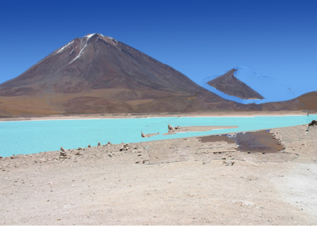

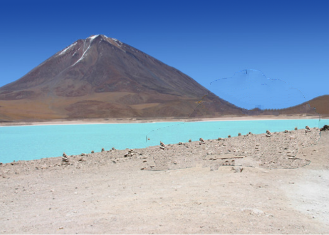

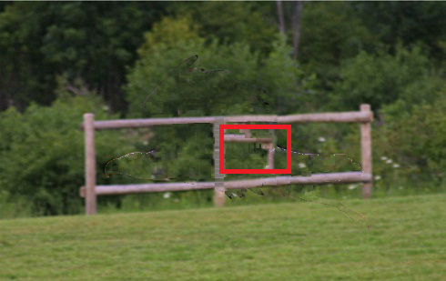

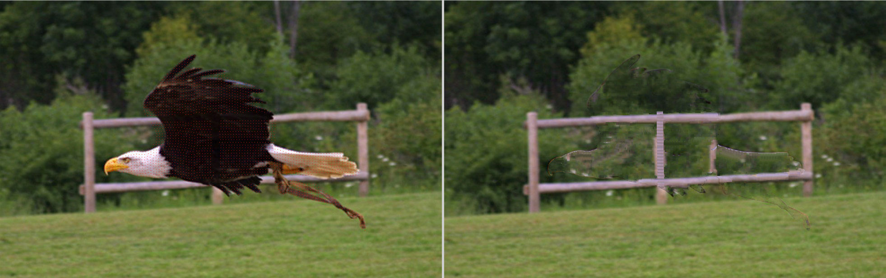

- Expand and Narrow(with and without)

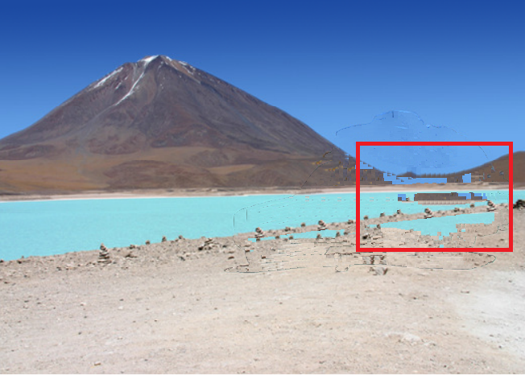


- Only Global search without structure line estimate(with and without)


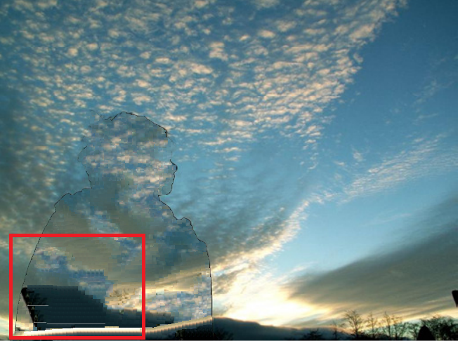

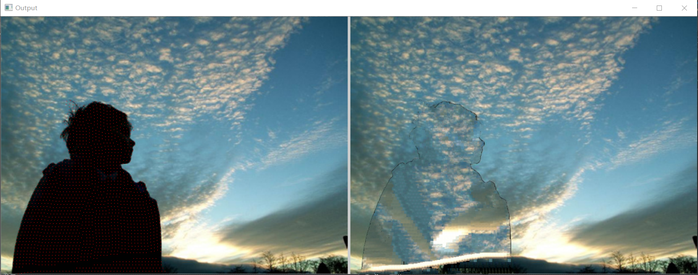